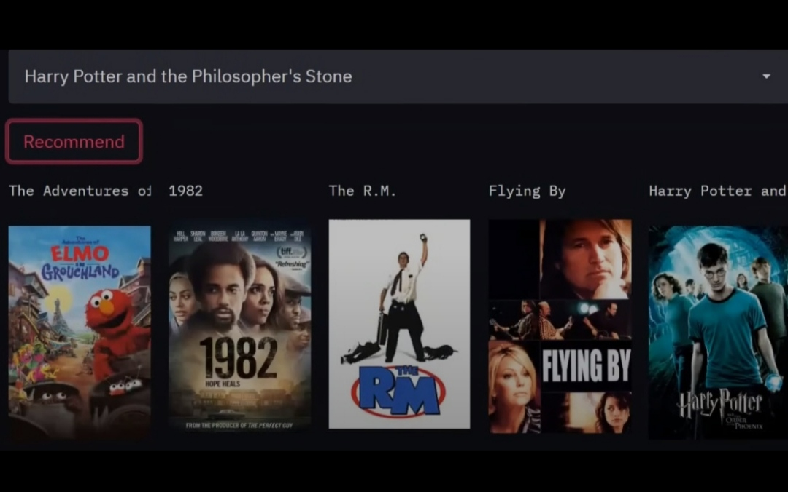

# 🎬 Movie Recommender System (Content-Based)

A content-based movie recommender system built using Python. It suggests movies similar to the input movie based on features like genres, cast, director, and plot overview—powered by natural language processing (NLP) and cosine similarity.



---

## 🚀 Project Overview

- Uses **content-based filtering** (no collaborative/user ratings)
- Combines movie metadata (genres, cast, crew, plot summary)
- Vectorizes text data using **TF-IDF**
- Computes **Cosine Similarity** to find similar movies
- Provides **top-N movie recommendations** for any given title

---

## ✅ Features

- 🔍 Search by movie title  
- 🎯 Finds movies with similar content  
- 🧠 Uses metadata (genre, cast, crew, synopsis)  
- ⚙️ TF-IDF + Cosine Similarity engine  
- ✅ Handles typos or missing titles gracefully  
- 🎥 Shows recommended movie posters (as UI cards)

---

## 📊 Model Pipeline

1. **Data Loading** – from CSV/JSON of metadata  
2. **Feature Extraction** – combine genre, cast, crew, overview  
3. **Text Vectorization** – TF-IDF on combined content  
4. **Similarity Matrix** – cosine similarity over movie vectors  
5. **Recommendation Function** – returns top-N similar movies

---

## 📦 Tech Stack

- **Python 3.8+**
- **Pandas**, **NumPy**
- **scikit‑learn** (for TF‑IDF & similarity)
- **Streamlit** (for web UI)

---

## 🔧 Setup & Run Locally

```bash
# Clone the repo
git clone https://github.com/DataShoaib/movie-recommender-system-.git
cd movie-recommender-system-

# Install dependencies
pip install -r requirements.txt

# Run the demo app
streamlit run app.py
```

---

## 🧠 How It Works

1. **User Input**: Provide a movie title  
2. **Title Matching**: Find the closest existing title  
3. **Content Vectorization**: Input movie’s combined metadata vector  
4. **Similarity Calculation**: Compute cosine similarity with all movies  
5. **Output**: Top-N similar movies are displayed with their posters

---

## 📌 Use-Cases

- Movie platforms (Netflix, Prime) demo systems
- Educational projects on recommender systems
- Portfolio ML showcase
- Offline search-based recommendation engine

---

## 🔮 Future Improvements

- 📬 Add collaborative filtering or hybrid model  
- 🖼 Include IMDb ratings, genres in UI  
- 📱 Deploy as mobile app or website  
- 🔄 Add user interaction and feedback-based tuning

---

## 👨‍💻 Author

**Shoaib Akhtar**  
📧 Email: [mdshoaib478@gmail.com](mailto:mdshoaib478@gmail.com)  
💻 GitHub: [DataShoaib](https://github.com/DataShoaib)

---

## ⭐ Support

If this project was helpful, please ⭐ **Star the repo** to support open-source development!

---
